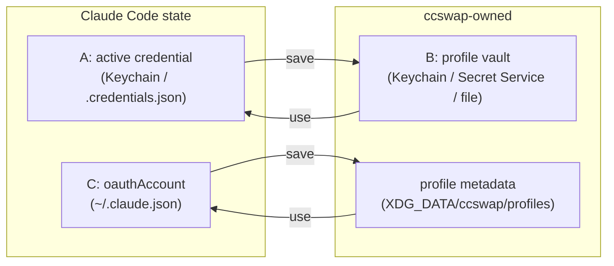
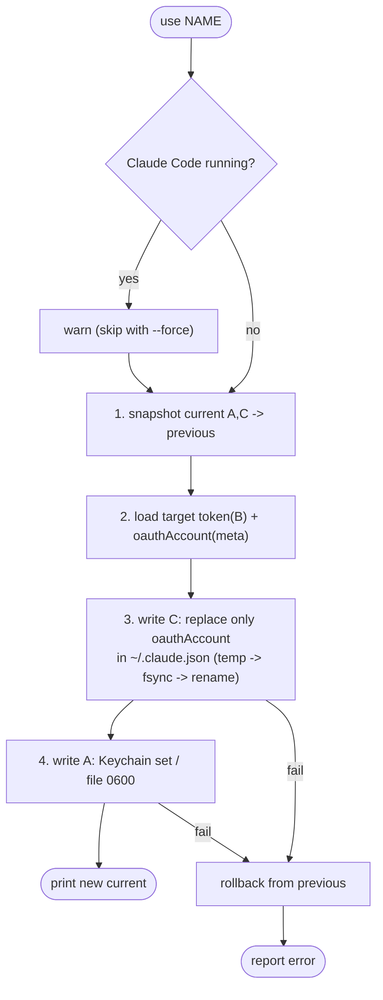

# ccswap — Design

`ccswap` is a profile switcher for Claude Code accounts. It lets you save the
currently logged-in Claude Code account under a name and switch between them.

Implemented in Rust, distributed via npm (prebuilt per-platform binaries).

## Scope

Simple, single-purpose CLI:

```
ccswap save <name>     Save the active account as <name>
ccswap use  <name>     Switch to <name> (`-` = previous account; --force skips advisory)
ccswap list            List saved profiles (current marked with *)
ccswap current         Show the active account
ccswap rm   <name>     Delete a profile
```

Non-goals (v1): managing `~/.claude/` settings/projects/history, multi-machine
sync, GUI.

## What a switch actually swaps

Claude Code identifies an account by **two** pieces of state that must move
together. `ccswap` touches only these and nothing else under `~/.claude/`.

| Ref | What | macOS | Linux |
|-----|------|-------|-------|
| **A** Active credential | The OAuth token Claude Code reads now | Keychain `Claude Code-credentials` (acct = `$USER`) | `~/.claude/.credentials.json` (0600) |
| **B** Profile vault | Per-profile saved tokens (ccswap-owned) | Keychain service `ccswap` | Secret Service, else 0600 file fallback |
| **C** Account identity | `oauthAccount` object | `~/.claude.json` | `~/.claude.json` |

A switch = swap **A** and **C** atomically as one unit. **B** is the store of
saved profiles.



### Account identity key

The `oauthAccount` object contains, among others:
`accountUuid`, `organizationUuid`, `emailAddress`, `organizationName`,
`displayName`.

- **Unique key** for matching: `accountUuid` + `organizationUuid`
  (one person can belong to multiple orgs).
- **Display**: `emailAddress` / `organizationName`.

`ccswap current` reads the live `oauthAccount` from `~/.claude.json`, matches the
`(accountUuid, organizationUuid)` pair against saved profiles, and prints the
matching name (or "unsaved account").

## Security — no leakage

The token must never leak. Guarantees, each backed by a test where possible:

- **No plaintext token on disk.** Secret tokens live only in the OS secret store
  (**B**), including the previous-account token kept under `__previous` for
  `use -`. The headless-Linux fallback file is `0600` under `XDG_DATA`. Profile
  metadata files contain the `oauthAccount` snapshot only — **never** the token.
- **`Secret` newtype** (`src/secret.rs`) is the only in-memory holder of raw token
  bytes. It does not implement `Display`/`Serialize`, its `Debug` is redacted
  (`Secret([redacted; N bytes])`), and it is **zeroized on drop**. Enforced by
  `debug_never_reveals_contents` and `zeroize_clears_buffer`.
- **Never via process args or env** — tokens move through keychain APIs and files,
  not argv/env, so they cannot appear in `ps` output.
- **Atomic writes preserve perms.** `~/.claude.json` is rewritten via temp→rename;
  the Linux credential file is created `0600` before any bytes are written.
- **`current`/`list` print identity only** (email, org, name) — never the token.

R1 (verified): the macOS keychain token is a 471-byte UTF-8 JSON string
(`{ "claudeAiOauth": ... }`), so a byte-for-byte vault round-trip is lossless.

## Local & self-contained after install

After installation `ccswap` does **zero network I/O**: no telemetry, no
auto-update, no remote calls. It depends only on the OS secret store and local
files. The npm install pulls a prebuilt binary as a platform package
(`optionalDependencies`), so even install does no postinstall download.

## XDG layout (strict XDG, including macOS)

```
$XDG_DATA_HOME/ccswap/profiles/<name>.json   # account identity snapshot (no token)
$XDG_STATE_HOME/ccswap/previous.json          # previous account (C); previous token (A) is in the vault under `__previous`
```

Defaults: `$XDG_CONFIG_HOME=~/.config`, `$XDG_DATA_HOME=~/.local/share`,
`$XDG_STATE_HOME=~/.local/state`.

> We use the `etcetera` crate's **Xdg** strategy so macOS also resolves to
> `~/.config` / `~/.local/share`. The popular `directories` crate would return
> `~/Library/Application Support` on macOS, which is not what we want here.

### Configuration (environment variables)

Overrides are read from the environment — there is **no config file**, which
keeps the dependency set minimal (no TOML parser). All optional; absent = the
discovered default:

- `CCSWAP_KEYCHAIN_ACCOUNT` — macOS Keychain account (default `$USER`).
- `CCSWAP_CLAUDE_JSON` — path to `~/.claude.json`.
- `CCSWAP_CREDENTIALS_PATH` — Linux active-credential file path.

## Store abstraction (the core of cross-platform support)

```rust
trait ActiveStore {                      // A: Claude Code's live slot
    fn read(&self)  -> Result<Vec<u8>>;
    fn write(&self, secret: &[u8]) -> Result<()>;
}
// macOS: keyring(Keychain "Claude Code-credentials", acct=$USER)
// linux: file ~/.claude/.credentials.json (atomic, 0600)

trait ProfileVault {                     // B: ccswap's store
    fn store(&self, name: &str, secret: &[u8]) -> Result<()>;
    fn load(&self, name: &str)  -> Result<Vec<u8>>;
    fn delete(&self, name: &str) -> Result<()>;
}
// keyring(Keychain / Secret Service) preferred;
// fall back to a 0600 file under XDG_DATA when no secret daemon is present.
```

## `use` — safe, rollback-capable procedure



Key safety property: the previous account **and its token** are snapshotted (to
`previous.json` and the vault's `__previous` slot) **before** any mutation, so an
in-process failure auto-rolls-back. A and C live in two different stores, so the
swap is **sequential + compensating, not truly atomic**: a hard kill between the
two writes can leave Claude Code half-switched — but because the previous token
is now persisted, `ccswap use -` recovers it. `~/.claude.json` is edited
surgically — only the `oauthAccount` key changes; all other keys are preserved
via read → replace → atomic rename.

ccswap **cannot reliably detect** whether Claude Code is running (the CLI leaves
no lock/pid file), so it does not try. `use` prints a one-line advisory to quit
Claude Code first; `--force` silences it.

## Crates

`clap` (derive), `keyring` v3, `serde` + `serde_json`, `etcetera`, `anyhow`.
Added incrementally as each feature's failing test requires them.

## Project layout

```
src/
  main.rs        clap CLI + dispatch
  paths.rs       XDG path resolution (etcetera Xdg strategy)
  claude.rs      ~/.claude.json oauthAccount read / surgical replace / atomic write
  active.rs      ActiveStore trait + macos/linux impls
  vault.rs       ProfileVault (keyring + file fallback)
  profile.rs     Profile model + registry (save/load/list/remove/current)
npm/
  package.json   main package + bin launcher + optionalDependencies
  bin/ccswap.js  resolves the platform binary and execs it
.github/workflows/release.yml
```

## npm distribution (optionalDependencies, esbuild-style)

- Per-platform packages: `@ccswap/darwin-arm64`, `@ccswap/darwin-x64`,
  `@ccswap/linux-x64-gnu`, `@ccswap/linux-arm64-gnu` (musl optional later).
  Each declares `os`/`cpu` and ships the binary.
- Main `ccswap` package lists all of them in `optionalDependencies`; npm installs
  only the matching one. `bin/ccswap.js` does `require.resolve` of the right
  package and `execFileSync`. No postinstall network access.
- CI: a GitHub Actions matrix builds each target (`cross` for linux-arm) and
  publishes the packages.

## Risks / assumptions

| # | Assumption | Mitigation |
|---|-----------|------------|
| R1 | Keychain token round-trips losslessly | **Verified**: UTF-8 JSON text |
| R2 | Linux active-credential path/shape (`~/.claude/.credentials.json`) | Validate on a real Linux host at Linux-impl time |
| R3 | Keychain acct = `$USER` | Confirmed locally; `config.toml` override |
| R4 | Secret Service may be absent (headless Linux) | 0600 file fallback |
| R5 | Claude Code running during `use` | Warn + rollback-on-failure |

## Testing strategy (TDD)

Unit tests for the pure logic, integration tests (`#[ignore]`) for the real OS
secret store:

- `claude.rs`: golden test that replacing `oauthAccount` preserves all other keys.
- `profile`: save → load round-trip.
- `current`: `(accountUuid, organizationUuid)` matching.
- atomic write: temp → rename leaves no partial file.
